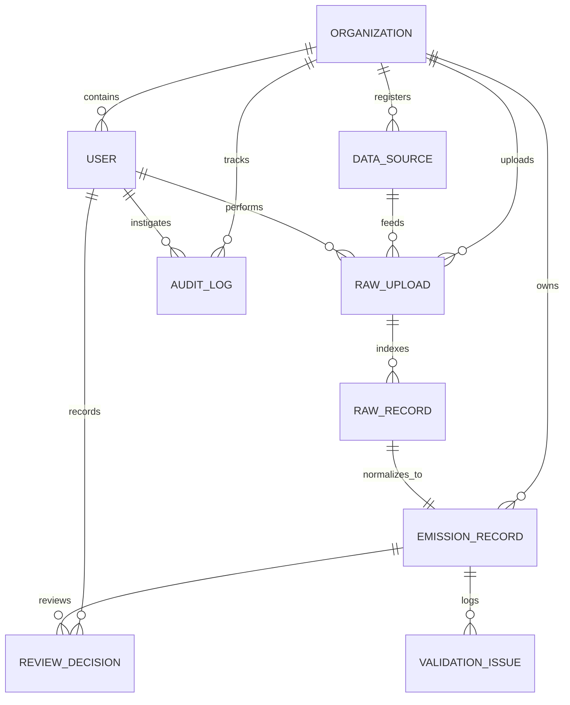

# Database Schema & Entity Relationships

This document outlines the architecture, normalization logic, and entity relationships of the Breathe ESG ingestion and audit platform.

## Database Schema Design

The database schema is structured for enterprise multi-tenancy, raw data lineage, and strict auditability. The primary key IDs are stored as 36-character UUID strings, ensuring compatibility across PostgreSQL and local SQLite databases.

### Table Definitions

1. **`organizations`**
   - Central tenant table. All activity data must isolate by organization.
   - Fields: `id` (PK), `name` (unique), `created_at`.

2. **`users`**
   - User account with email verification and roles.
   - Fields: `id` (PK), `username` (unique), `email` (unique), `hashed_password`, `is_active`, `is_analyst`, `organization_id` (FK), `created_at`.

3. **`datasources`**
   - Configured data input source definitions.
   - Fields: `id` (PK), `name`, `source_type` ("sap", "utility", "travel"), `organization_id` (FK), `connection_config` (JSON for API configs), `is_active`, `created_at`.

4. **`raw_uploads`**
   - Upload session tracking representing a single CSV upload or API sync run.
   - Fields: `id` (PK), `organization_id` (FK), `datasource_id` (FK), `uploader_id` (FK), `filename`, `file_size`, `status` ("pending", "processed", "failed"), `error_message`, `created_at`.

5. **`raw_records`**
   - Row-level database store of original unparsed/parsed payload data. Ensures absolute data lineage.
   - Fields: `id` (PK), `raw_upload_id` (FK), `row_index` (int), `raw_payload` (JSON block), `status`, `error_message`, `created_at`.

6. **`emission_records`**
   - Core normalized ESG table containing standardized scopes, activity classifications, and computed CO2 equivalents.
   - Fields:
     - `id` (PK), `organization_id` (FK), `raw_record_id` (FK, unique)
     - `source_type`, `source_reference` (Invoice number/meter ID/booking reference)
     - `activity_type`, `category`, `scope` ("Scope 1", "Scope 2", "Scope 3")
     - `amount`, `original_unit`
     - `normalized_unit`, `normalized_value`
     - `emission_factor` (kg CO2e / unit)
     - `estimated_emissions` (kg CO2e total)
     - `confidence_score` (float 0.0 - 1.0)
     - `validation_status` ("pending", "validated", "flagged")
     - `review_status` ("pending", "approved", "rejected")
     - `locked_for_audit` (boolean, defaults false)
     - `transaction_date` (Date)
     - `facility_id` (Plant code / Meter ID)
     - `cost_center`
     - `created_at`, `updated_at`

7. **`validation_issues`**
   - Holds alerts and warnings created by the validation engine during ingestion.
   - Fields: `id` (PK), `emission_record_id` (FK), `issue_type` ("duplicate", "negative_value", "overlapping_cycle", etc.), `field`, `message`, `severity` ("warning", "error"), `created_at`.

8. **`review_decisions`**
   - Tracks review logs, approvals, rejections, and comments created by analysts.
   - Fields: `id` (PK), `emission_record_id` (FK), `analyst_id` (FK), `action` ("approve", "reject", "comment"), `comment_text`, `created_at`.

9. **`audit_logs`**
   - Strict system-wide audit table mapping mutations and actors.
   - Fields: `id` (PK), `organization_id` (FK), `user_id` (FK), `action` ("approve_record", "upload_data", etc.), `target_type`, `target_id`, `before_state` (JSON), `after_state` (JSON), `ip_address`, `created_at`.

---

## Normalization Strategy

We map inconsistent inputs into a unified emissions schema via three layers:
1. **Unit Normalization (`unit_normalizer`)**: Converts mixed inputs (e.g. gallons, kiloliters, cubic feet) to standardized baseline equivalents (e.g. Liters, cubic meters, kWh) using static conversion factor maps.
2. **Scope Classification (`scope_classifier`)**: Standardizes input names to match GHG Protocol categories:
   - *SAP Fuel purchases* (Diesel, Heating Oil, Petrol, Propane, Gas) $\rightarrow$ Scope 1 (Direct Combustion)
   - *Grid power consumption* (kWh) $\rightarrow$ Scope 2 (Indirect Electricity)
   - *Business Travel* (Flights, hotel stays, land transit) $\rightarrow$ Scope 3 (Indirect Value Chain)
3. **Emissions Multiplier (`emission_mapper`)**: Fetches matching emission factors (kg CO2e per unit) and computes emissions:
   $$\text{Emissions (kg CO2e)} = \text{Normalized Value} \times \text{Emission Factor}$$

---

## Multi-Tenancy

We enforce logical multi-tenancy at the database level.
- **Tenant Keying**: All tables containing operational logs or calculations (users, uploads, records, audits) hold a mandatory `organization_id` column.
- **Query Filtration**: Every API endpoint filters records matching the `organization_id` of the current authenticated user (`current_user.organization_id`).

---

## Auditability & Lineage

The system satisfies rigorous accounting standards:
- **Raw Data Preservation**: Original data payloads are preserved in a JSON column inside the `raw_records` table. We can re-run parsing or audit the exact input at any time.
- **Sealing / Audit Lock**: Once an analyst clicks **Approve**, the record's `locked_for_audit` flag is set to `True`. Database hooks and API layers block any subsequent updates or rejections to prevent tampering.
- **State Diffs**: Audit logs record JSON payloads showing `before_state` and `after_state` for all transitions.
